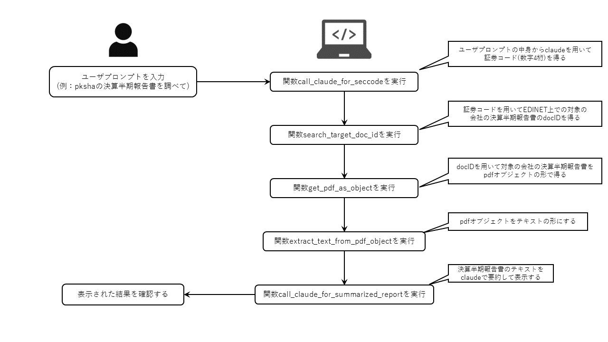

# このフォルダのプログラムについて

このフォルダのmainプログラム(main.ipynb)は、LLMエージェントの要素はあまり無いものの、LLMアプリ的なものを作ってみようと思って作成しました。

## 概要

このmainプログラム(main.ipynb)は、ユーザプロンプトに決算半期報告書を確認したい旨を会社名も含めて入力する事で、
その会社の決算半期報告書をEDINETから取得して、その内容をLLMで要約してその結果を表示します。

以下に、mainプログラムの概要図と処理フローを示す図を掲載します。

