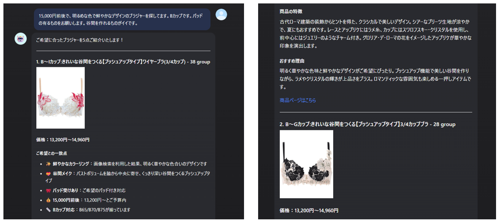
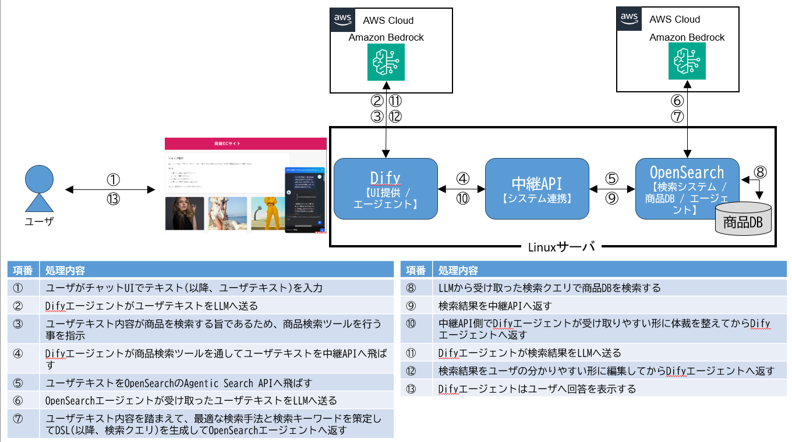
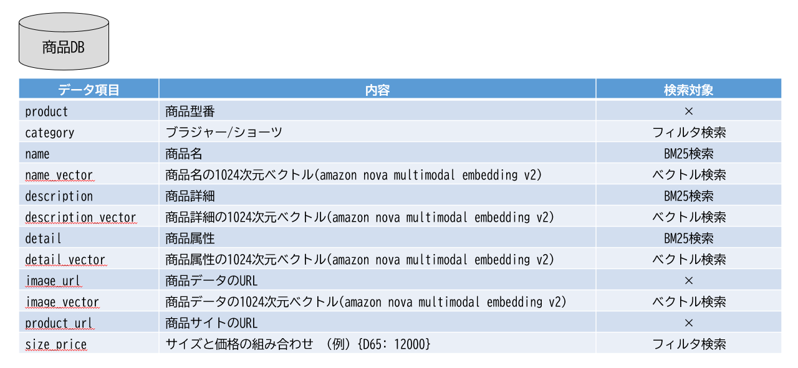

# 下着検索AIエージェント

## Dify × FastAPI × OpenSearch Agentic Searchによるマルチモーダル商品検索

自然な文章で入力した検索条件から、**ブラジャーやショーツの商品を検索するAIエージェント**のサンプル実装です。

商品名や商品説明などのテキスト情報だけでなく、**商品画像をベクトル化した情報も検索に利用**することで、「かわいい」「夏っぽい」「レースがある」「セクシー系」など、商品の見た目や雰囲気を含む自然な検索を実現します。

検索条件には、商品のデザインだけでなく、**サイズや価格などの条件も指定できます。**

---

## こんな検索ができます

例えば、次のような自然文を入力できます。

```text
セクシー系で、レースがあって、1万円くらいのブラジャーで
おすすめを教えて。
```

```text
夏っぽくて、白系のショーツを探しています。
```

```text
普段使いしやすくて、かわいいブラジャーを探して。
```

また、ブラジャーとショーツをまとめて探したい場合は、

```text
ブラジャーとショーツをセットで探したい
```

のような依頼にも対応します。

この場合、DifyのAIエージェントが検索内容を判断し、ブラジャーとショーツに分けて検索を実行します。

---

# イメージ図







---

# このシステムで実現していること

### 1. 自然文による商品検索

「商品名」などの検索項目を意識して指定する必要はありません。

例えば、

```text
かわいくてレースがあって、1万円くらいのブラジャー
```

のような自然な文章をそのまま入力できます。

---

### 2. 複数条件をまとめて指定

以下のような複数の条件を1回の自然文に含めることができます。

* カテゴリー
* デザイン・雰囲気
* 商品の特徴
* サイズ
* 価格

AIが検索意図を解釈し、OpenSearchの検索条件に変換します。

---

### 3. 商品画像も検索に利用

商品名・商品説明・商品詳細などのテキストだけでなく、**商品画像もベクトル化して検索に利用**します。

そのため、

```text
夏っぽい
白系
かわいい
レースがある
```

など、テキストとして明確な属性値を持っていない「見た目・雰囲気」に関する検索にも対応できます。

---

### 4. テキスト検索とベクトル検索を組み合わせる

検索では、OpenSearchの

* BM25による全文検索
* ベクトル検索
* 構造化された条件による絞り込み

を組み合わせます。

検索意図に応じて、商品名・商品説明・商品詳細・商品画像など、それぞれの検索結果の重要度を調整します。

---

### 5. サイズと価格を組み合わせた検索

商品ごとにサイズと価格の組み合わせを保持しています。

例えば、

```json
[
  {
    "size": "C65",
    "price": 13200
  },
  {
    "size": "C70",
    "price": 13200
  },
  {
    "size": "D65",
    "price": 14300
  }
]
```

のようなデータ構造です。

OpenSearchでは `nested` 型として保持することで、**サイズと価格の組み合わせを維持した検索**ができるようにしています。

---

# システム構成

```text
ユーザー
   │
   │ 自然文
   ▼
┌─────────────────────┐
│      Dify Agent      │
│      Claude Sonnet   │
└──────────┬──────────┘
           │
           │ OpenAPIツール
           ▼
┌─────────────────────┐
│       FastAPI        │
│    検索API・中継処理   │
└──────────┬──────────┘
           │
           │ 自然文検索
           ▼
┌─────────────────────────────┐
│   OpenSearch Agentic Search │
│                             │
│      QueryPlanningTool      │
│              │              │
│              ▼              │
│       OpenSearch DSL生成     │
└──────────────┬──────────────┘
               │
               ▼
        ┌───────────────┐
        │ OpenSearch    │
        │    Index      │
        └───────┬───────┘
                │
        ┌───────┴────────┐
        │                │
        ▼                ▼
   BM25検索          ベクトル検索
                         │
              ┌──────────┼──────────┐
              ▼          ▼          ▼
          商品名       商品説明    商品画像
          ベクトル     ベクトル    ベクトル
```

検索結果はFastAPIからDifyへ返され、DifyのAIエージェントがユーザー向けの回答として整理します。

---

# OpenSearchの検索構成

今回のOpenSearchインデックスでは、主に以下の情報を保持しています。

| 項目 | 用途 |
| -------- | --------------- |
| 商品コード | 商品の識別 |
| カテゴリー | ブラジャー／ショーツの絞り込み |
| 商品名 | BM25＋ベクトル検索 |
| 商品説明 | BM25＋ベクトル検索 |
| 商品詳細 | BM25＋ベクトル検索 |
| 商品画像 | 表示＋画像ベクトル検索 |
| 商品ページURL | 商品ページへのリンク |
| サイズ | 絞り込み |
| 価格 | 絞り込み |

商品名・商品説明・商品詳細・商品画像については、Amazon Bedrockの**Amazon Nova Multimodal Embedding v2**を利用して1024次元のベクトルに変換しています。

---

# 検索の考え方

OpenSearch Agentic Searchの `QueryPlanningTool` に自然文を渡し、検索意図に応じたOpenSearchの検索DSLを生成します。

生成された検索では、例えば以下のような検索を組み合わせます。

```text
自然文
  │
  ▼
検索意図の解釈
  │
  ├─ カテゴリー
  ├─ 価格
  ├─ サイズ
  ├─ 商品名
  ├─ 商品説明
  ├─ 商品詳細
  └─ 商品画像・デザイン
       │
       ▼
OpenSearch DSL
       │
       ├─ BM25検索
       ├─ 商品名ベクトル検索
       ├─ 商品説明ベクトル検索
       ├─ 商品詳細ベクトル検索
       ├─ 商品画像ベクトル検索
       └─ 条件による絞り込み
       │
       ▼
    商品検索結果
```

例えば「夏っぽい」「かわいい」「レースがある」など、商品の見た目や雰囲気を重視する検索では、商品画像をベクトル化した情報を利用します。

一方、「手洗い可能」「ポリエステル」「D65」など、商品情報として明確に記載されている条件については、テキスト検索や構造化された条件検索を利用します。

---

# ブラジャーとショーツの検索

このシステムでは、

```text
ブラジャー
ショーツ
```

を同じ検索APIから扱えるようにしています。

例えば、

```text
ブラジャーで、かわいくてレースがあるもの
```

であればブラジャーを検索し、

```text
ショーツで、夏っぽくて白系のもの
```

であればショーツを検索します。

さらに、

```text
ブラジャーとショーツをセットで探したい
```

のように複数カテゴリーを含む依頼については、Dify Agent側で検索内容を分解し、それぞれについて検索ツールを呼び出して結果をまとめます。

---

# FastAPI

DifyからOpenSearch Agentic Searchを呼び出すための中継APIとしてFastAPIを利用しています。

主な役割は以下です。

* Difyから自然文を受け取る
* OpenSearch Agentic Searchを呼び出す
* 検索結果を取得する
* Difyで扱いやすい形式に整形して返す

検索API：

```text
POST
/search_bra_and_panty_by_opensearch_agentic_search
```

リクエスト例：

```json
{
  "query": "セクシー系で、レースがあって、1万円くらいのブラジャーを探して"
}
```

レスポンスには、検索に利用されたDSLと商品検索結果を含めています。

---

# Dify

DifyではAIエージェントを構築し、FastAPIをOpenAPIツールとして登録しています。

Dify Agentの主な役割は、

1. ユーザーの自然文を理解する
2. 必要に応じて検索ツールを呼び出す
3. 検索結果を確認する
4. ユーザー向けに結果を整理して回答する

ことです。

特に複数カテゴリーを含む検索では、検索内容をカテゴリーごとに分解してツールを呼び出すようにしています。

---

# ディレクトリ構成

```text
agentic_search_with_dify_and_opensearch
│
├── dify
│   └── tool.yaml
│
├── fastapi
│   ├── Dockerfile
│   ├── docker-compose.yaml
│   └── main.py
│
├── opensearch
│   ├── 01_create_connector_deploy_model.ipynb
│   ├── 02(bra_panty)create_agent_pipeline.ipynb
│   ├── 03(bra_panty)create_db_index.ipynb
│   ├── 04(bra_panty)register_data.ipynb
│   └── 05(bra_panty)search.ipynb
│
└── README.md
```

---

# 各ファイルの役割

## `dify/tool.yaml`

DifyからFastAPIの検索APIを呼び出すためのOpenAPIツール定義です。

---

## `fastapi/main.py`

Difyから受け取った自然文をOpenSearch Agentic Searchへ渡し、検索結果を整形して返すAPIを実装しています。

---

## `fastapi/Dockerfile`

FastAPIをコンテナとして実行するための設定です。

---

## `fastapi/docker-compose.yaml`

FastAPIの実行環境を構築するための設定です。

---

## `opensearch/01_create_connector_deploy_model.ipynb`

OpenSearchからAmazon Bedrockのモデルを利用するための接続・モデル関連の設定を行います。

---

## `opensearch/02(bra_panty)create_agent_pipeline.ipynb`

OpenSearch Agentic Searchで利用する検索パイプラインやエージェント関連の設定を行います。

---

## `opensearch/03(bra_panty)create_db_index.ipynb`

商品検索用のOpenSearchインデックスおよびマッピングを設定します。

---

## `opensearch/04(bra_panty)register_data.ipynb`

商品データをOpenSearchへ登録します。

商品名・商品説明・商品詳細・商品画像などの情報をベクトル化して検索に利用します。

---

## `opensearch/05(bra_panty)search.ipynb`

OpenSearch Agentic Searchを利用した商品検索を実行します。

---

# 使用している主な技術

* Dify
* OpenSearch
* OpenSearch Agentic Search
* QueryPlanningTool
* Amazon Bedrock
* Amazon Nova Multimodal Embedding v2
* Claude Sonnet
* FastAPI
* Docker
* Python

---

# この実装について

このシステムでは、従来の商品検索で利用されるキーワード検索だけではなく、

**「ユーザーが自然な文章で表現した商品への要望」**

をAIが解釈し、

**テキスト情報・商品画像・価格・サイズなど複数の情報を組み合わせて商品を検索する**

ことを目的としています。

例えば、

```text
セクシー系で、レースがあって、
1万円くらいのブラジャーでおすすめを教えて。
```

という検索に対して、

```text
カテゴリー
＋
デザイン
＋
商品特徴
＋
価格
＋
商品画像
```

を組み合わせて検索することで、単純なキーワード検索とは異なる商品検索を実現します。

---

# 展示・デモ

本実装は、**生成AIなんでも展示会 Vol.6**での展示デモとしても利用しています。

自然文による下着検索を題材として、

```text
ユーザー
  ↓
Dify AIエージェント
  ↓
FastAPI
  ↓
OpenSearch Agentic Search
  ↓
BM25 ＋ ベクトル検索 ＋ 条件検索
  ↓
商品検索結果
```

という一連の処理を実際に動かしています。

---
